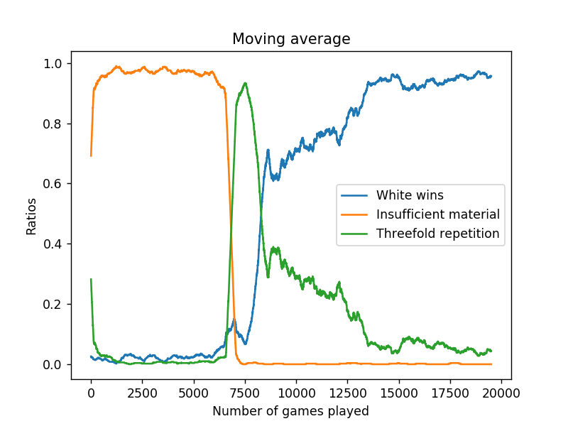
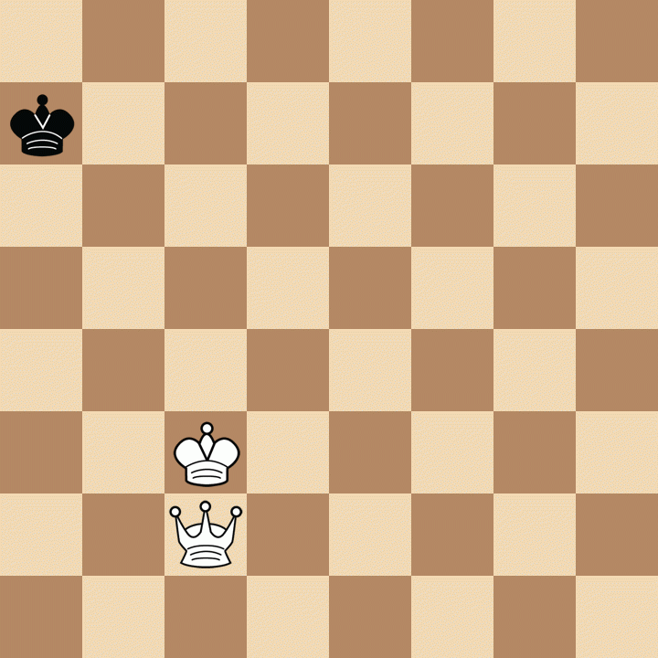

# chess_endgame_AI

AI trained to deliver checkmate by reinforcement learning in an endgame.

## Description

AI is trained to deliver checkmate in an endgame starting with black king, white king, white queen and white to move. With best play this starting position is always winning for white. Value function is the number of moves until checkmate by white. From hand selected features extracted from the chess board position a neural network gives the value function as an output.

The training is done via TD(lambda) [temporal difference learning](https://en.wikipedia.org/wiki/Temporal_difference_learning) algorithm. From a random starting position both sides play best moves according to the value function. Update of parameters of neural network is done after the game.

Ratio of white wins during 20000 training games is shown below. An example game played by both untrained and trained model are also shown. 

### Training progress:

### Game played by the untrained model:

### Game played by the trained model:

